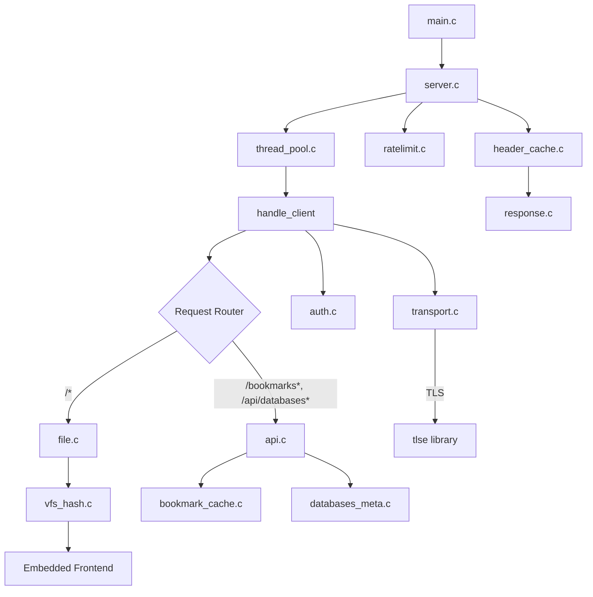
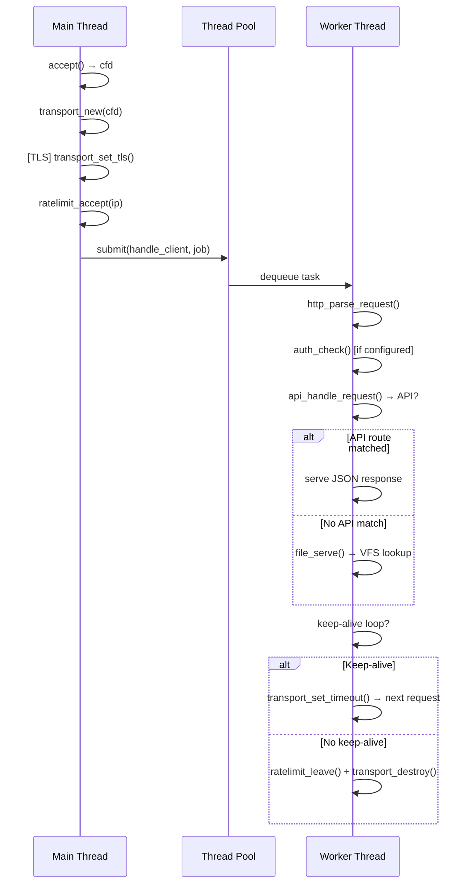

# DEV.md — Developer Guide

> **Audience**: Developers working on the project, API consumers, contributors implementing features.
>
> For the complete codebase reference (module internals, data flow, memory ownership), see [DEV_IN_DEPTH.md](DEV_IN_DEPTH.md).

---

## Architecture Overview

LocalMarks is a single-binary HTTP server that serves an embedded SPA and a JSON API for browsing bookmark databases.



### Components

| Component          | Responsibility                                                            |
| ------------------ | ------------------------------------------------------------------------- |
| `main.c`           | CLI parsing (argp), validation, startup orchestration                     |
| `server.c`         | Accept loop, signal handling, thread pool dispatch, keep-alive, TLS setup |
| `transport.c`      | Opaque socket I/O wrapper (handles partial writes, TLS, writev)           |
| `http.c`           | HTTP request parser (GET/HEAD only, buffered, in-place)                   |
| `response.c`       | HTTP response builders (status, error, redirect)                          |
| `api.c`            | API endpoint routing (`/bookmarks*`, `/api/databases*`, `/redirect`)      |
| `file.c`           | VFS-based static file serving (embedded frontend, no filesystem access)   |
| `vfs_hash.c`       | O(1) hash table for embedded files (FNV-1a, linear probe)                 |
| `bookmark_cache.c` | Multi-DB JSON cache with mtime invalidation (rwlock)                      |
| `databases_meta.c` | File metadata (stat, user/group, realpath) for each DB                    |
| `header_cache.c`   | Pre-computed Date/Server/Connection headers (updated 1 Hz)                |
| `auth.c`           | HTTP Basic Authentication                                                 |
| `thread_pool.c`    | Fixed-size thread pool with bounded work queue                            |
| `ratelimit.c`      | Per-IP connection rate limiting (open-addressing hash)                    |
| `log.c`            | Thread-safe logger (mutex-protected fprintf)                              |
| `mime.c`           | MIME type detection by file extension                                     |

### Request Lifecycle



Key invariants:

- Main thread only accepts + dispatches. Never blocks on I/O.
- Worker threads handle full request lifecycle (parse → serve → keep-alive).
- API endpoints checked first, then VFS fallback.
- All shared state protected by mutexes (ratelimit, header_cache, bookmark_cache, thread pool queue).

---

## Build System

### Build Targets

| Command                   | Description                                                 |
| ------------------------- | ----------------------------------------------------------- |
| `make`                    | Release build (`-O3`) → `./local-mark`                      |
| `make debug -B O_DEBUG=1` | Debug build (`-g3 -DDEBUG -fsanitize=address,undefined`)    |
| `make tls`                | Build with TLS support (downloads tlse into `third_party/`) |
| `make clean`              | Remove build artifacts                                      |
| `make strip`              | Strip debug symbols                                         |
| `sudo make install`       | Install to `/usr/local/bin` (or `PREFIX=~/.local`)          |
| `sudo make uninstall`     | Remove installed files                                      |

### Build Flags

| Flag                           | When      | Purpose                        |
| ------------------------------ | --------- | ------------------------------ |
| `-O3`                          | Release   | Optimization                   |
| `-g3 -DDEBUG`                  | Debug     | Debug symbols + `DEBUG` macro  |
| `-fsanitize=address,undefined` | Debug     | ASan + UBSan                   |
| `-DLOG_SHOW_TIME_STAMP`        | Always    | Timestamps in log output       |
| `-DLOG_SHOW_SOURCE_LOCATION`   | Always    | `file:line:func` in log output |
| `-DSUPPORT_TLS_E`              | `O_TLS=1` | TLS support                    |
| `-D_GNU_SOURCE`                | Linux     | POSIX extensions               |

### Frontend Embedding

The frontend is embedded into the binary at build time:

1. `front_end/embed_frontend.bash` gzip-compresses each frontend file
2. `xxd -i` converts compressed bytes into C arrays
3. A `vfs_entry vfs_table[]` is generated with path/data/size for each file
4. At runtime, `vfs_hash_init()` builds an O(1) hash table from this array
5. `file_serve()` looks up requests in the hash table — no filesystem access

Re-embedding triggers automatically when any `FRONT_END_FILES` or the embed script changes.

### Generated Files

| File                                 | Purpose                                             |
| ------------------------------------ | --------------------------------------------------- |
| `build/gen_embedded_front_end_dir.c` | Embedded frontend data (C arrays + vfs_entry table) |
| `build/gen_embedded_front_end_dir.o` | Compiled object                                     |
| `src/gen_embedded_front_end_dir.h`   | Header with extern array declarations               |
| `build/src/*.o`                      | Compiled source objects                             |
| `build/src/*.d`                      | Auto-generated dependency files                     |

> **Note**: Headers are not tracked in Makefile deps. Run `make clean` after header changes.

### Development Workflow

```sh
# Typical cycle
make clean && make             # Verify clean build (0 warnings)
make clean && make debug -B O_DEBUG=1  # Debug build with sanitizers

# Frontend changes
# Edit front_end/ files → make re-runs embed_frontend.bash automatically

# After header changes
make clean && make
```

---

## API Documentation

All endpoints are GET-only. Authentication (when configured) applies to all endpoints.

### `GET /bookmarks.json`

Serve the first bookmark database (backward-compatible).

- **Response**: `200 OK`, `application/json; charset=utf-8`, `Cache-Control: no-cache`
- **Body**: Full bookmark JSON (see [JSON Schema](#json-schema) below)
- **Error**: `500` if cache load fails

### `GET /bookmarks/<index>.json`

Serve a specific bookmark database by index.

- **Path params**: `index` — integer (0, 1, 2...)
- **Response**: `200 OK`, same as above
- **Error**: `404` if index out of range, `500` if cache load fails

### `GET /api/databases`

List all registered databases with metadata.

- **Response**: `200 OK`, `application/json; charset=utf-8`
- **Body**:

```json
{
  "databases": [
    {
      "mode": "0644",
      "absolute_path": "/Users/you/work.json",
      "file_name": "work.json",
      "file_size": 2410,
      "cTime": 1700000000,
      "bTime": 1690000000,
      "user": "pritam",
      "group": "staff",
      "mTime_sec": 1700000000,
      "mTime_nsec": 123456789
    }
  ],
  "count": 1
}
```

### `GET /api/databases/<index>`

Single database metadata.

- **Path params**: `index` — integer
- **Response**: `200 OK` with single database object (same fields as array entry)
- **Error**: `404` if index out of range

### `GET /redirect?url=...&db=...&title=...`

Log a bookmark click and redirect to external URL.

- **Query params**: `url` (required, must be `http://` or `https://`), `db` (optional int), `title` (optional string)
- **Response**: `302 Found` with `Location` header
- **Error**: `400` if missing/invalid URL or non-http(s) scheme

### JSON Schema

```json
{
  "book_Marks": [
    {
      "category": "Category Name",
      "bookmarks": [
        {
          "title": "Display Title",
          "url": "https://example.com",
          "description": "Optional description",
          "tags": ["#tag1", "#tag2"],
          "domain": "example.com",
          "icon": "https://..."
        }
      ]
    }
  ],
  "book_mark_domain_hash": { "example.com": 42 },
  "book_mark_tag_hash": { "#tag1": 10, "#tag2": 5 }
}
```

`icon` is only present for YouTube channels when `--icon` flag is used with `marks2json`.

---

## Concurrency Model

### Thread Pool

- Fixed-size pool (default 2 workers, configurable via `--threads`)
- Circular work queue with 4096 slots
- Mutex + two condvars (`not_empty`, `not_full`)
- `thread_pool_submit()` blocks if queue is full (backpressures the accept loop)
- `thread_pool_destroy()` sets stop flag, broadcasts all condvars, joins all workers
- Each task has a `drop_func` callback for cleanup if dropped during shutdown

### Per-Connection State

Each accepted connection becomes a `ClientJob` containing:

- `Transport *t` — opaque socket wrapper
- `client_ip[INET6_ADDRSTRLEN]` + `client_port`
- `const ServerConfig *cfg` — pointer to shared config
- `RateLimit *rl` — pointer to rate limiter

Worker threads handle the full lifecycle: parse → auth → serve → keep-alive loop → cleanup.

### Rate Limiting

- Per-IP concurrent connection limit (when `--max-conns` > 0)
- Open-addressing hash table with djb2 hash, initial size 256
- Grows 2x when load factor reaches 75%
- Stale sweep every 60 seconds: dormant entries (count=0, older than 60s) are evicted
- Single mutex covers all operations

### Bookmark Cache

- `pthread_rwlock_t` with two-phase locking:
  - **Phase 1 (read lock)**: Fast path — if data is cached and mtime unchanged, copy under read lock
  - **Phase 2 (write lock)**: Slow path — upgrade to write lock only when loading/reloading
- mtime-based invalidation: edit the JSON file while server is running, next request picks up changes
- Max 10 databases (`MAX_BOOKMARK_FILES` in `common.h`)

### Header Cache

- Date header updated once per second (mutex-protected)
- Server header set once at init (immutable)
- Connection headers are compile-time string constants

### Thread Safety Summary

| Module            | Lock Type          | Contention       |
| ----------------- | ------------------ | ---------------- |
| Thread pool queue | mutex + 2 condvars | High under load  |
| Bookmark cache    | rwlock             | Low (read-heavy) |
| Rate limiter      | mutex              | Per-IP only      |
| Header cache      | mutex              | 1 Hz updates     |
| Logger            | mutex              | Every log call   |

---

## Repository Layout

```
local_marks/
├── Makefile                      # Build system
├── marks2json.py                 # Python: create/update/find-dead bookmark DBs
├── local-mark                    # Built binary
├── local-mark.1                  # Man page
│
├── front_end/                    # Embedded SPA source
│   ├── embed_frontend.bash       # gzip + xxd → C arrays
│   ├── index.html                # SPA entry (hash routing)
│   ├── javascript/               # ES modules (no bundler)
│   │   ├── main.js               # Entry, router, boot
│   │   ├── data.js               # Fetch, IndexedDB, favorites, themes
│   │   ├── browse.js             # Browse view orchestration
│   │   ├── sidebar.js            # Category sidebar + DB info bar
│   │   ├── panel.js              # Bookmark card rendering
│   │   ├── search.js             # Search index + results
│   │   ├── tag_bar.js            # Tag filter pills
│   │   ├── keyboard.js           # Vim-style shortcuts
│   │   ├── databases.js          # Database selector UI
│   │   ├── info.js               # Stats, charts, domain grid
│   │   ├── random.js             # Random link picker
│   │   ├── notes.js              # Per-bookmark notes (localStorage)
│   │   └── modal.js              # Reusable modal overlay
│   └── stylesheet/
│       ├── style.css             # Main styles (dark/light via CSS vars)
│       └── themes/light.css      # Light theme overrides
│
├── src/                          # C source (flat, .c/.h pairs)
│   ├── main.c                    # Entry: argp CLI, validation
│   ├── server.c / .h             # Accept loop, thread dispatch
│   ├── transport.c / .h          # Socket abstraction + TLS
│   ├── http.c / .h               # Request parser
│   ├── response.c / .h           # Response builders
│   ├── api.c / .h                # API endpoints
│   ├── file.c / .h               # VFS file serving
│   ├── vfs_hash.c / .h           # VFS hash table
│   ├── bookmark_cache.c / .h     # Multi-DB JSON cache
│   ├── databases_meta.c / .h     # DB file metadata
│   ├── header_cache.c / .h       # Pre-computed headers
│   ├── auth.c / .h               # Basic auth
│   ├── thread_pool.c / .h        # Thread pool
│   ├── ratelimit.c / .h          # Per-IP rate limiting
│   ├── log.c / .h                # Logger
│   ├── mime.c / .h               # MIME detection
│   ├── error.c / .h              # HTTP status lookup
│   ├── fnv1a.h                   # FNV-1a hash (header-only)
│   ├── common.h                  # Shared constants
│   ├── project_config.h          # Version, name, metadata
│   ├── embd_front_end.h          # vfs_entry struct declaration
│   └── gen_embedded_front_end_dir.h  # Auto-generated VFS declarations
│
└── third_party/                  # TLS library (downloaded by make tls)
```

---

## Development Guidelines

### Coding Conventions

- **Language**: C17 (`-std=c17`)
- **Indentation**: Tabs in C/Makefile, 4-space in Python
- **Header guards**: `_FILENAME_H_` double underscore style
- **No test framework** — verify with `make clean && make` (clean rebuild, no warnings)
- **`.clang-tidy`** enforces: clang-analyzer, readability, modernize, bugprone, misc-include-cleaner

### Logging

```c
LOG_INFO("started on port %d", port);
LOG_ERROR("failed: %s", strerror(errno));
LOG_DEBUG("bookmark count: %zu", count);
LOG_PERROR("bind failed");    // logs message + appends perror
```

Levels: `LOG_LEVEL_OFF`, `FATAL`, `ERROR`, `WARN`, `INFO`, `DEBUG`, `TRACE`.

The logger uses mutex-protected fprintf to stderr or a file. Auto-detects TTY for color output.

### Error Handling

- HTTP errors use `response_error()` which sends styled HTML pages
- API errors return JSON or HTML depending on the endpoint
- Fatal errors use `LOG_FATAL()` which calls `abort()`
- No exceptions — all errors handled via return codes

### Testing

No automated test suite. Verify via:

```sh
make clean && make             # Clean build, zero warnings
make clean && make debug -B O_DEBUG=1  # Debug build with sanitizers
./local-mark bookmarks.json    # Manual smoke test
./local-mark db1.json db2.json  # Multi-DB test
```

### Adding Features

See [DEV_IN_DEPTH.md §Files an Agent Might Need to Touch](DEV_IN_DEPTH.md#files-an-agent-might-need-to-touch) for a mapping of tasks to source files.

---

## marks2json.py

Python tool for managing bookmark databases. Requires the `requests` package.

| Command                                                         | Description                            |
| --------------------------------------------------------------- | -------------------------------------- |
| `marks2json create *.txt -T bookmarks.json`                     | Create new database                    |
| `marks2json update *.txt -T bookmarks.json`                     | Append new bookmarks (skip duplicates) |
| `marks2json update *.txt -T bookmarks.json --override`          | Update existing entries                |
| `marks2json find-dead -T bookmarks.json`                        | Check link health (HEAD requests)      |
| `marks2json find-dead -T bookmarks.json --healthy healthy.json` | Write clean DB                         |

### marks2json Flags

| Flag              | Description                                     |
| ----------------- | ----------------------------------------------- |
| `-T, --to FILE`   | Output JSON file (required)                     |
| `-O, --override`  | Update existing entries (update only)           |
| `-I, --icon`      | Fetch YouTube channel icons (create only)       |
| `--status CATS`   | Dead link categories (default: `4xx,5xx,error`) |
| `--concurrency N` | Parallel HEAD requests (default: 5)             |
| `--timeout SECS`  | Per-request timeout (default: 10)               |
| `--healthy FILE`  | Write healthy-only database                     |

### marks2json Input Format

```txt
title | url | description | #tag1 #tag2
```

- Lines starting with `#` → comments
- Lines without `http(s)://` → skipped
- Filename → category name (`work_tools.txt` → "Work Tools")
- Tags are space-separated, each prefixed with `#`
- Duplicate URLs within a category are deduplicated

### Link Health Categories

| Category   | Condition                                   |
| ---------- | ------------------------------------------- |
| `ok`       | HTTP 2xx                                    |
| `redirect` | HTTP 3xx                                    |
| `4xx`      | HTTP 4xx                                    |
| `5xx`      | HTTP 5xx                                    |
| `error`    | Connection error, timeout, or other failure |

Retries once on `ConnectionError` (not timeout). Results sorted by URL for deterministic output.
