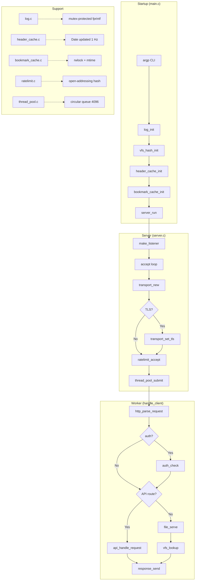
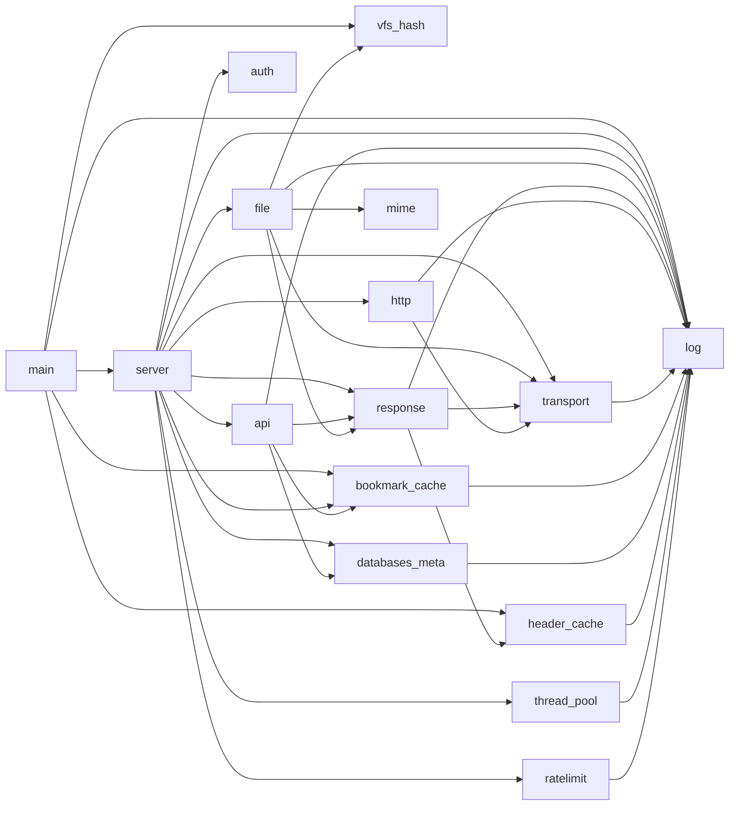
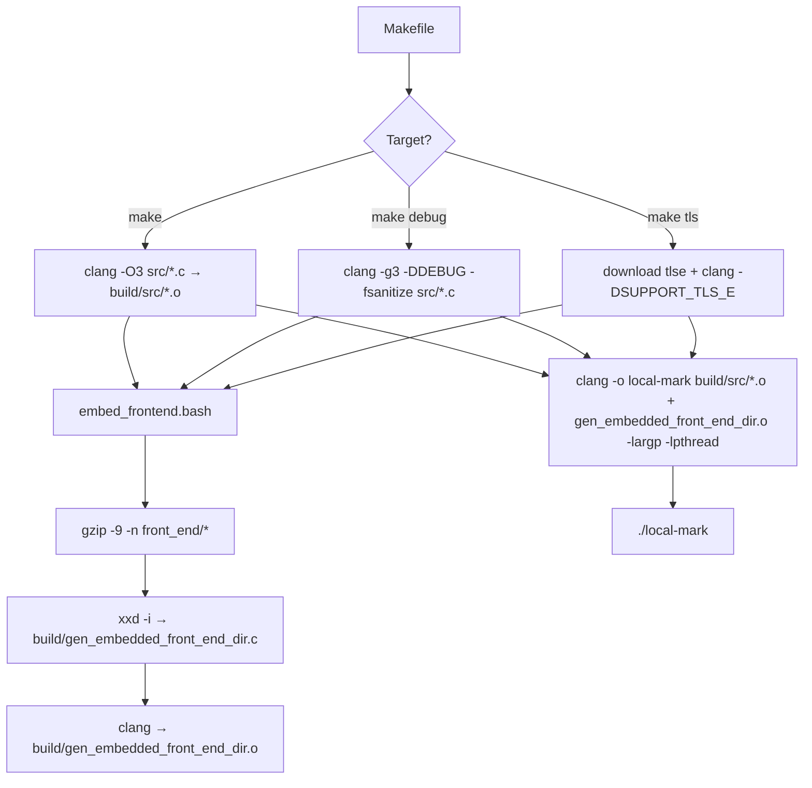

# DEV_IN_DEPTH.md — Complete Codebase Reference

> **Audience**: New contributors, engineers making architectural changes, AI coding agents.
>
> **Goal**: A reader should obtain a complete, accurate understanding of the codebase in a single read. This document describes **what exists**, not what should exist.
>
> For higher-level overviews, see [README.md](README.md) (users) and [DEV.md](DEV.md) (developers).

---

## 1. Project Identity

| Attribute        | Value                                                                                                        |
| ---------------- | ------------------------------------------------------------------------------------------------------------ |
| **Name**         | local-mark                                                                                                   |
| **Language**     | C17 (`-std=c17 -Wall -Wextra -Wpedantic -Wstrict-prototypes -Wmissing-prototypes -Wshadow -Wconversion`)     |
| **Platforms**    | Linux, macOS (POSIX)                                                                                         |
| **Dependencies** | Zero runtime deps. Build-time: `argp-standalone` on macOS, `pthread`. Optional: `tlse` (TLS, via `make tls`) |
| **Binary**       | Single executable `./local-mark` (~400 KB stripped)                                                          |
| **License**      | MIT                                                                                                          |
| **Version**      | 1.1.0                                                                                                        |

**Philosophy**: Local-first bookmark browser. Single binary serving embedded SPA + multi-database JSON API. No config files, no env vars, no external DB. All config via CLI flags.

---

## 2. Complete Architecture

### 2.1 Subsystem Overview



### 2.2 Module Responsibilities

| Module             | Responsibility                         | Key Export                            |
| ------------------ | -------------------------------------- | ------------------------------------- |
| `main.c`           | CLI parsing, validation, startup       | `main()`                              |
| `server.c`         | Accept loop, dispatch, keep-alive, TLS | `server_run()`                        |
| `transport.c`      | Opaque socket I/O (plain + TLS)        | `transport_new/write/read/destroy`    |
| `http.c`           | HTTP request parser (GET/HEAD)         | `http_parse_request()`                |
| `response.c`       | HTTP response builders                 | `response_send()`, `response_error()` |
| `api.c`            | API endpoint routing                   | `api_handle_request()`                |
| `file.c`           | VFS file serving                       | `file_serve()`                        |
| `vfs_hash.c`       | O(1) embedded file lookup              | `vfs_lookup()`                        |
| `bookmark_cache.c` | Multi-DB JSON cache                    | `get_cached_bookmark_json_copy()`     |
| `databases_meta.c` | DB file metadata                       | `build_databases_json()`              |
| `header_cache.c`   | Pre-computed headers                   | `header_cache_build()`                |
| `auth.c`           | Basic authentication                   | `auth_check()`                        |
| `thread_pool.c`    | Fixed-size worker pool                 | `thread_pool_submit()`                |
| `ratelimit.c`      | Per-IP connection limiting             | `ratelimit_accept()`                  |
| `log.c`            | Thread-safe logging                    | `log_record()`                        |
| `mime.c`           | MIME type detection                    | `mime_from_path()`                    |
| `error.c`          | HTTP status text lookup                | `error_find_status_text()`            |

### 2.3 Dependencies Between Modules



---

## 3. Execution Flow

### 3.1 Startup Sequence

```
1. argp_parse() → fills global G_Args, runs all validation
2. log_init(file, level) → sets up output stream + mutex
3. vfs_hash_init() → builds hash table from vfs_table[], pre-computes content hashes
4. header_cache_init() → sets Date + Server headers
5. populate_db_meta_all() → stats all bookmark files
6. bookmark_cache_init() → zeroes cache array
7. bookmark_cache_add_db() × N → registers each DB path
8. server_run(&cfg):
   a. Signal setup: SIGINT/SIGTERM → g_shutdown; SIGPIPE/SIGCHLD → SIG_IGN
   b. make_listener() → getaddrinfo → socket → SO_REUSEADDR|SO_REUSEPORT → listen(128)
   c. thread_pool_create(N)
   d. ratelimit_create(max_conns) [if configured]
   e. [TLS] tls_init → tls_create_context → load cert/key
   f. Accept loop: accept → transport_new → [TLS] set_tls → transport_accept → peer_addr → ratelimit_accept → thread_pool_submit
```

### 3.2 Request Handling (Worker Thread)

```
1. http_parse_request(t, &req) → heap-allocates raw[8192], parses in-place
   - Rejects null bytes in URL
   - Rejects .. path traversal
   - Only GET/HEAD recognized
2. auth_check() [if user/pass configured] → 401 or continue
3. api_handle_request():
   - /redirect?url=...&db=...&title=... → log click, 302 redirect
   - /bookmarks.json → serve first DB
   - /bookmarks/<idx>.json → serve DB by index
   - /api/databases → list all DBs with metadata
   - /api/databases/<idx> → single DB metadata
   - Returns 1 if handled, 0 otherwise
4. If not API → file_serve():
   - Strip leading /, default to index.html
   - vfs_lookup(path) → vfs_entry*
   - If-None-Match → 304 (ETag: hash-size)
   - Range requests → 206/416
   - Gzip detection (magic bytes 0x1f 0x8b)
   - MIME from extension
   - response_send() via writev (header+body in one syscall)
5. Keep-alive loop: transport_set_timeout() → goto step 1
6. Cleanup: http_request_cleanup(), ratelimit_leave(), transport_destroy(), free(job)
```

### 3.3 Shutdown Sequence

```
1. Signal handler sets g_shutdown = 1
2. Accept loop breaks
3. close(lfd) — stop accepting new connections
4. thread_pool_destroy() — set stop flag, broadcast condvars, join all workers
5. ratelimit_destroy() — free hash table + mutex
6. [TLS] tls_destroy_context(tls_master)
7. bookmark_cache_cleanup() — free all cached JSON, destroy rwlock
8. db_meta_cleanup() — reset counter
```

---

## 4. Source Tree Walkthrough

### 4.1 `src/main.c` — Entry Point

- Uses GNU argp for argument parsing with a `parse_opt()` callback
- Global `G_Args` struct holds all parsed values (no dynamic allocation — string pointers into argv)
- Validation: port 1–65535, threads 1–256, keep-alive 0–3600, max-conns 0–1000
- TLS: cert+key must both be present or both absent; files checked with `access(R_OK)`
- Initializes subsystems in order: log → vfs_hash → header_cache → bookmark_cache
- Builds `ServerConfig` from `G_Args`, calls `server_run()`

### 4.2 `src/server.c` — Server Core

- **Signals**: SIGINT/SIGTERM → `g_shutdown=1`; SIGPIPE/SIGCHLD → `SIG_IGN`
- **TLS** (when `SUPPORT_TLS_E`): master context created once, per-connection child contexts via `tls_accept()`
- **Accept loop**: blocking `accept()`, wraps fd in `Transport`, TLS handshake if configured, IP extraction, rate limiting, thread pool dispatch
- **`ClientJob`**: owns Transport, client IP/port, pointer to ServerConfig, pointer to RateLimit
- **Keep-alive**: `wants_keep_alive()` checks HTTP version + Connection header; loop continues with `transport_set_timeout()`
- **`open_browser()`**: forks + execs; falls back to `xdg-open` (Linux) or `open` (macOS); two versions compiled under `#ifdef SUPPORT_TLS_E`

### 4.3 `src/transport.c` — Socket Abstraction

Opaque `struct Transport { int fd; [TLSContext *tls_ctx] }`.

| Function                         | Behavior                                                                                          |
| -------------------------------- | ------------------------------------------------------------------------------------------------- |
| `transport_new(fd)`              | calloc, set TCP_NODELAY                                                                           |
| `transport_set_tls(t, master)`   | Create child TLS context via `tls_accept()`                                                       |
| `transport_accept(t)`            | Plain: no-op. TLS: handshake loop (up to 20 rounds)                                               |
| `transport_read(t, buf, len)`    | Plain: `read()`. TLS: `tls_pending()` → `tls_consume_stream()` → `tls_read()`                     |
| `transport_write(t, buf, len)`   | Plain: loop `write()`. TLS: chunk at 16384 → `tls_write()` → `tls_get_write_buffer()` → `write()` |
| `transport_writev(t, iov, cnt)`  | Plain: single `writev()`. TLS: sequential `transport_write()` per iov                             |
| `transport_close(t)`             | TLS: `tls_close_notify()` + `tls_destroy_context()`. Then `close(fd)`                             |
| `transport_destroy(t_ptr)`       | close + free + nullify caller's pointer                                                           |
| `transport_set_timeout(t, secs)` | `setsockopt(SO_RCVTIMEO)`                                                                         |
| `transport_is_tls(t)`            | Returns `tls_ctx != NULL` (compiled out without TLS)                                              |

### 4.4 `src/http.c` — Request Parser

- **Buffered reads**: 4 KB chunks into heap-allocated `raw` buffer until `\r\n\r\n`
- **Request line**: method (GET/HEAD/OTHER), URI split on `?`, URL-decode path
- **Path traversal**: rejects `..` in decoded path, rejects null bytes
- **Headers**: extracts Authorization, Connection, If-None-Match, Range (suffix `-N` supported)
- **No body parsing** — only GET/HEAD supported
- **In-place parsing**: `\r\n` replaced with `\0`

### 4.5 `src/vfs_hash.c` — VFS Hash Table

- FNV-1a hash + linear probing
- Table size: next power of 2 ≥ 2× `VFS_MAX_FILES` (default 20 → 64 slots)
- Built once at startup: `vfs_hash_init()` iterates `vfs_table[]`, pre-computes content hashes
- Lookup: `vfs_lookup(path)` → `vfs_entry*` or NULL
- Load factor warning at ≥ 50%

### 4.6 `src/file.c` — VFS File Serving

1. Method check: GET/HEAD only → 405
2. Path normalization: strip leading `/`, default to `index.html`
3. VFS lookup: `vfs_lookup(path)` → `vfs_entry*`
4. Conditional GET: `If-None-Match` (ETag) → 304
5. ETag: pre-computed FNV-1a hash + size → `"<hash>-<size>"`
6. Range requests: parses `bytes=N-M`, `N-`, `-N`; validates; serves partial
7. Gzip detection: embedded files pre-compressed → `Content-Encoding: gzip`
8. MIME: `mime_from_path()` from extension
9. Response: `response_send()` with `writev()`

### 4.7 `src/header_cache.c` — Pre-computed Headers

| Header                 | Update                | Thread Safety |
| ---------------------- | --------------------- | ------------- |
| Date                   | Once per second       | Mutex         |
| Server                 | Once at init          | Immutable     |
| Connection: keep-alive | Compile-time constant | None needed   |
| Connection: close      | Compile-time constant | None needed   |

`header_cache_build()` assembles full HTTP response header via single `snprintf`.

### 4.8 `src/bookmark_cache.c` — Multi-DB JSON Cache

- `pthread_rwlock_t` with two-phase locking
- **Phase 1 (rdlock)**: Fast path — data cached and mtime unchanged → copy under read lock
- **Phase 2 (wrlock)**: Slow path — unlock rdlock, take wrlock, re-check, load/reload
- mtime-based invalidation: edit JSON on disk → next request reloads
- Max `MAX_BOOKMARK_FILES` (10) entries

### 4.9 `src/ratelimit.c` — Per-IP Rate Limiting

- Open-addressing hash table with djb2 hash
- Initial size 256, grows 2x at 75% load factor
- `RLEntry { char *ip, int count, time_t last_activity }`
- Stale sweep every 60 seconds: evicts dormant entries (count=0, older than 60s)
- `ratelimit_leave()` keeps dormant entries for reuse (freed by sweep)
- Single mutex covers all operations

### 4.10 `src/log.c` — Logger

**Important**: Despite what some docs claim, the logger is **not** a lock-free ring buffer. It is **mutex-protected fprintf** to stderr or a file.

- Levels: OFF, FATAL, ERROR, WARN, INFO, DEBUG, TRACE
- Thread safety: `pthread_mutex_t` around every `log_record()` call
- Timestamp: `clock_gettime(CLOCK_REALTIME)` → microsecond precision (when `-DLOG_SHOW_TIME_STAMP`)
- Color: auto-detected via `isatty(fileno(stderr))`; disabled for file output
- Source location: `file:line:func` (when `-DLOG_SHOW_SOURCE_LOCATION`)
- `LOG_PERROR()`: appends `strerror(errno)` to the message

### 4.11 `src/api.c` — API Routing

Pure GET-only routing. Internal helpers:

- `send_json_response()`: adds `Cache-Control: no-cache`
- `query_param()`: extracts + URL-decodes a query parameter from the URI

### 4.12 `src/auth.c` — Basic Auth

- Hand-rolled Base64 decoder
- Constant-time comparison is **not** used (known weakness)
- Auth disabled when both user and pass are NULL

### 4.13 `src/thread_pool.c` — Fixed-Size Pool

- Circular queue: 4096 `ThreadTask { func, drop_func, arg }`
- Mutex + `not_empty` + `not_full` condvars
- Workers: `lock → wait(not_empty) → dequeue → unlock → func(arg)`
- `thread_pool_submit()`: blocks if queue full (backpressures accept loop)
- `thread_pool_destroy()`: sets stop flag, broadcasts both condvars, joins all

### 4.14 `src/mime.c` — MIME Detection

- Static table of ~50 extension mappings
- Case-insensitive `strcasecmp()` on extension (after last `.`)
- Fallback: `application/octet-stream`

### 4.15 `src/error.c` — Status Text Lookup

- Designated initializer array indexed by status code (100–511)
- O(1) lookup via `error_find_code()` and `error_find_status_text()`

### 4.16 `src/databases_meta.c` — DB File Metadata

- Populates `g_db_meta[]` from `stat()` on each bookmark file
- `realpath()` for absolute path
- `getpwuid()` / `getgrgid()` for user/group names (fallback to numeric)
- `json_escape_string()` handles control chars as `\u00XX`
- macOS-specific: reads `st_birthtime`

### 4.17 Frontend Modules (`front_end/javascript/`)

| Module         | Purpose                                                                   |
| -------------- | ------------------------------------------------------------------------- |
| `main.js`      | Entry point, hash router, boot sequence, sidebar resizer                  |
| `data.js`      | Shared data layer: fetch, IndexedDB cache, favorites, themes, buildCard() |
| `browse.js`    | Browse view orchestration: sidebar, panel, search, tag bar, keyboard      |
| `sidebar.js`   | Category sidebar with event delegation + DB info bar                      |
| `panel.js`     | Bookmark card rendering for active category/favorites                     |
| `search.js`    | Linear substring search, grouped results                                  |
| `tag_bar.js`   | Tag filter pills (first 30, expandable)                                   |
| `keyboard.js`  | Vim-style shortcuts, help modal, toast notifications                      |
| `databases.js` | Database selector: cards, search/filter, metadata display                 |
| `info.js`      | Stats strip, category chart, tag cloud, domain grid                       |
| `random.js`    | Fisher-Yates partial shuffle, category/tag filters                        |
| `notes.js`     | Per-bookmark notes in localStorage                                        |
| `modal.js`     | Reusable modal overlay (lazy-created)                                     |

---

## 5. Data Flow

### 5.1 Bookmark Data Path

```
marks2json create *.txt → bookmarks.json
                         ↓
./local-mark bookmarks.json → bookmark_cache_add_db(path)
                              ↓
                    [First request] → load_bookmark_json() → stat() mtime
                              ↓
                    get_cached_bookmark_json_copy() → malloc'd JSON copy
                              ↓
                    api_handle_request() → send_json_response()
                              ↓
                    Frontend: fetchBookmarks(idx) → IndexedDB cache
```

### 5.2 Frontend Data Path

```
Browser → #databases → fetchDatabases() → /api/databases → render cards
         ↓ (click card)
         → setActiveDbIndex(idx) → #browse → ensureDataLoaded()
         → fetchBookmarks(idx) → /bookmarks/<idx>.json → IndexedDB cache
         → initBrowse(data) → renderSidebar() + renderPanel() + initSearch()
```

### 5.3 Embedded Frontend Path

```
front_end/* → embed_frontend.bash → gzip -9 -n → xxd -i → C arrays
            → build/gen_embedded_front_end_dir.c → compiled into binary
            → vfs_hash_init() → hash table at runtime
            → file_serve() → vfs_lookup() → response_send()
```

---

## 6. Internal APIs

### 6.1 Transport API (`transport.h`)

The **only** way to touch sockets. All callers use this instead of raw fd operations.

```c
Transport *transport_new(int fd);
int        transport_accept(Transport *t);      // TLS handshake if configured
ssize_t    transport_read(Transport *t, void *buf, size_t len);
ssize_t    transport_write(Transport *t, const void *buf, size_t len);
ssize_t    transport_writev(Transport *t, const struct iovec *iov, int iovcnt);
void       transport_close(Transport *t);
void       transport_destroy(Transport **t);    // nullifies pointer
int        transport_set_timeout(Transport *t, int seconds);
int        transport_fd(const Transport *t);
bool       transport_is_tls(const Transport *t);
void       transport_set_tls(Transport *t, struct TLSContext *master);  // TLS only
```

### 6.2 Response API (`response.h`)

```c
void response_send(Transport *t, int status, const char *status_text,
                   const char *mime, const char *extra_hdrs,
                   const char *body, size_t body_len,
                   int keep_alive, int send_body);
void response_error(Transport *t, int status, const char *detail);
```

### 6.3 Bookmark Cache API (`bookmark_cache.h`)

```c
void   bookmark_cache_init(void);
void   bookmark_cache_cleanup(void);
void   bookmark_cache_add_db(const char *path);
char  *get_cached_bookmark_json_copy(int index, size_t *out_len);  // caller frees
```

### 6.4 Header Cache API (`header_cache.h`)

```c
void header_cache_init(void);
int  header_cache_build(char *buf, size_t buf_len, int status,
                        const char *status_text, const char *content_type,
                        size_t content_length, const char *extra_headers,
                        int keep_alive);
int  header_cache_date_copy(char *buf, size_t buf_len);
const char *header_cache_server(void);
const char *header_cache_conn(int keep_alive);
```

---

## 7. Configuration

All configuration is via CLI flags — no config files, no environment variables.

| Flag                 | Short | Default   | Type          | Range                                 |
| -------------------- | ----- | --------- | ------------- | ------------------------------------- |
| `--log-level`        | `-L`  | `info`    | string        | off/fatal/error/warn/info/debug/trace |
| `--log-file`         | `-F`  | stderr    | string (path) | —                                     |
| `--print-request`    | `-R`  | false     | bool          | —                                     |
| `--user`             | `-u`  | NULL      | string        | —                                     |
| `--pass`             | `-p`  | NULL      | string        | —                                     |
| `--port`             | `-P`  | 8080      | int           | 1–65535                               |
| `--host`             | `-H`  | localhost | string        | —                                     |
| `--threads`          | `-T`  | 2         | int           | 1–256                                 |
| `--keep-alive`       | `-K`  | 3         | int           | 0–3600 (0=disable)                    |
| `--max-conns`        | `-M`  | 0         | int           | 0–1000 (0=unlimited)                  |
| `--browser`          | `-B`  | NULL      | string        | —                                     |
| `--tls-cert`         | `-c`  | NULL      | string (path) | TLS only                              |
| `--tls-key`          | `-k`  | NULL      | string (path) | TLS only                              |
| positional `FILE...` | —     | required  | string[]      | max 10                                |

---

## 8. Build Pipeline



### Frontend Embedding Details

```bash
# Per file in FRONT_END_FILES:
gzip -9 -n -c front_end/{path} > gzip_stage/{sym}.gz  # -n for reproducibility
xxd -n {sym} -i gzip_stage/{sym}.gz                    # → unsigned char array
```

Output: `vfs_entry vfs_table[]` with `{ "path", symbol_name, sizeof symbol_name }` entries.

---

## 9. Runtime Model

### Threads

| Thread       | Count         | Purpose                                      |
| ------------ | ------------- | -------------------------------------------- |
| Main         | 1             | Accept loop, dispatch                        |
| Workers      | N (default 2) | Full request lifecycle                       |
| Log consumer | 1             | Drains log buffer (if ring) or handles mutex |

### Processes

- `fork()` + `execlp()` for `open_browser()` only
- `SIGCHLD` ignored to prevent zombies

### I/O Model

- Blocking I/O throughout (no epoll/kqueue/IOCP)
- Thread pool prevents fork bomb
- `TCP_NODELAY` on all connections
- `writev()` for header+body in one syscall (plaintext only)

---

## 10. Error Handling

- HTTP errors: `response_error()` sends styled HTML pages with `prefers-color-scheme` support
- API errors: JSON or HTML depending on endpoint
- Fatal errors: `LOG_FATAL()` → `abort()`
- No exceptions — all errors via return codes
- Transport errors: logged, connection closed, rate limit decremented

---

## 11. Logging

- **Implementation**: mutex-protected fprintf to stderr or file (not a ring buffer)
- **Levels**: OFF(0), FATAL(1), ERROR(2), WARN(3), INFO(4), DEBUG(5), TRACE(6)
- **Format**: `[timestamp] [level] [file:line:func] message`
- **Color**: auto-detected TTY; FATAL=blue, ERROR=red, WARN=yellow, INFO=green, DEBUG=cyan, TRACE=magenta
- **Macros**: `LOG_ERROR()`, `LOG_WARN()`, `LOG_INFO()`, `LOG_DEBUG()`, `LOG_PERROR()`, `LOG_FATAL()`, `LOG_TRACE()`
- `LOG_LEVEL_IS_ENABLED(level)` checks at call site (outside mutex)

---

## 12. Memory Ownership

| Object                                   | Owner                       | Lifetime                                               |
| ---------------------------------------- | --------------------------- | ------------------------------------------------------ |
| `Transport*`                             | `ClientJob` → worker thread | Single request (or keep-alive loop)                    |
| `HttpRequest.raw`                        | `http_parse_request()`      | Until `http_request_cleanup()`                         |
| `get_cached_bookmark_json_copy()` return | Caller                      | Caller must `free()`                                   |
| `build_databases_json()` return          | Caller                      | Caller must `free()`                                   |
| `build_database_json()` return           | Caller                      | Caller must `free()`                                   |
| `bookmark_cache_entry_t.json`            | `bookmark_cache`            | Until cleanup or reload                                |
| `ClientJob`                              | Worker thread               | `malloc` in accept loop, `free` in worker or drop_func |
| `ThreadPool`                             | `server_run()`              | Created at startup, destroyed at shutdown              |
| `RateLimit`                              | `server_run()`              | Created at startup, destroyed at shutdown              |

---

## 13. External Dependencies

| Dependency        | When            | Why                                                             |
| ----------------- | --------------- | --------------------------------------------------------------- |
| `argp-standalone` | macOS only      | GNU argp argument parsing (ships with glibc on Linux)           |
| `pthread`         | Always          | Thread pool, mutexes, rwlocks                                   |
| `tlse`            | `make tls` only | TLS support (single-file library, zero runtime deps without it) |

---

## 14. Known Limitations

- **No HTTP/2** — blocking I/O + thread pool is HTTP/1.1 only
- **No runtime compression** — files pre-gzipped at embed time
- **No directory listing** — VFS serves only known embedded files
- **Max 10 databases** — `MAX_BOOKMARK_FILES` constant (easy to increase in `common.h`)
- **No config file / env vars** — all CLI flags
- **No automated tests** — verify with `make clean && make`
- **No metrics endpoint** — not an observability target
- **Auth not constant-time** — vulnerable to timing attacks (acceptable for local use)
- **macOS argp** — requires `brew install argp-standalone`

---

## 15. Files an Agent Might Need to Touch

| Task                          | Files                                                                                          |
| ----------------------------- | ---------------------------------------------------------------------------------------------- |
| Add CLI flag                  | `main.c` (argp options + `parse_opt`), `server.h` (ServerConfig), `server.c` (config plumbing) |
| New MIME type                 | `mime.c` (table entry)                                                                         |
| New log level                 | `log.h` (enum), `log.c` (macro + colour)                                                       |
| Change thread pool queue size | `thread_pool.c` (QUEUE_CAPACITY = 4096)                                                        |
| Adjust rate limiter size      | `ratelimit.c` (initial size 256)                                                               |
| Add API endpoint              | `api.c` (new route in `api_handle_request`)                                                    |
| Increase max databases        | `common.h` (MAX_BOOKMARK_FILES), `bookmark_cache.c` (array size)                               |
| Modify embedded frontend      | `front_end/embed_frontend.bash`, `Makefile` (FRONT_END_FILES)                                  |
| Add response header           | `header_cache.c` (if static) or `response.c` (if dynamic)                                      |

---

## 16. Mental Model Checklist

- [ ] Single binary, no runtime deps, CLI-only config
- [ ] Main thread = accept + dispatch only
- [ ] Workers = full request lifecycle (parse → serve → keep-alive)
- [ ] Logger = mutex-protected fprintf (not a ring buffer)
- [ ] VFS = embedded files only, hash table lookup, gzip pre-compressed
- [ ] Multi-database = per-DB cache with rwlock + mtime invalidation
- [ ] API first, then VFS file serving
- [ ] All shared state protected by mutexes (ratelimit, header_cache, bookmark_cache, thread pool queue)
- [ ] `Transport` is the **only** way to touch sockets
- [ ] `writev()` for all plaintext responses
- [ ] TLS (optional): `transport_write()` chunks plaintext 16KB, `transport_writev()` writes each iov separately
- [ ] No streaming request bodies (GET/HEAD only)
- [ ] No directory listing, no runtime compression, no HTTP/2

---

_Generated from codebase inspection. Update when architecture changes._
