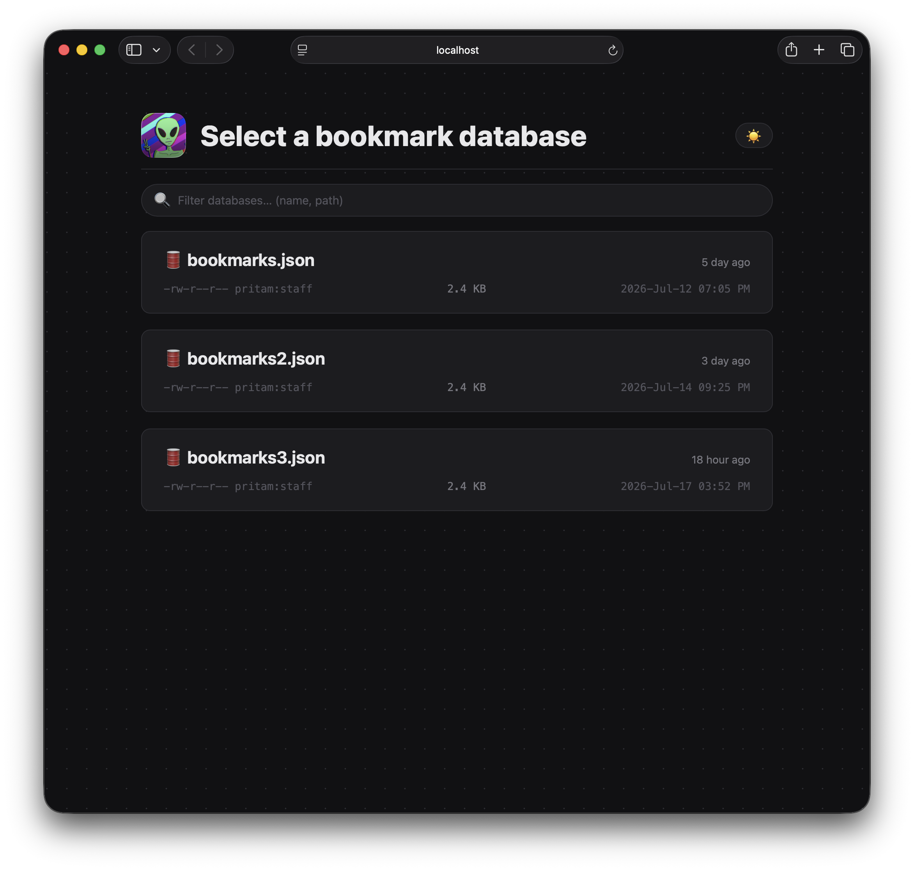

<h1 align="center">
	<br>
	
	<br>
	📚 LocalMarks
	<br>
	<br>
</h1>

Turn pipe-delimited bookmark files into a searchable, categorized local web UI. A single C17 binary serves a static frontend with tag/domain filters, no network required — just a browser.


## Table of Contents

- [Quick Start](#quick-start)
- [Prerequisites](#prerequisites)
- [Building from Source](#building-from-source)
- [Creating Your Bookmark Database](#creating-your-bookmark-database)
- [Running the Viewer](#running-the-viewer)
- [Running with TLS](#running-with-tls)
- [Multi-Database Support](#multi-database-support)
- [Configuration Options](#configuration-options)
- [Writing `.txt` Bookmark Files](#writing-txt-bookmark-files)
- [marks2json — The Converter](#marks2json--the-converter)
- [Features](#features)
- [Keyboard Shortcuts](#keyboard-shortcuts)
- [Project Structure](#project-structure)
- [Troubleshooting](#troubleshooting)
- [License](#license)

## Quick Start

```sh
# 1. Build
make

# 2. Create bookmark database from your .txt files
./marks2json create *.txt -T bookmarks.json

# 3. Start the server
./local-mark bookmarks.json

# 4. Open http://localhost:8080 in your browser
#    → Lands on Database Selector page
#    → Click a database to load it
```

## Prerequisites

| Platform   | Requirements                                                                  |
| ---------- | ----------------------------------------------------------------------------- |
| **macOS**  | Xcode Command Line Tools + `argp-standalone` (`brew install argp-standalone`) |
| **Linux**  | `clang` or `gcc` + `make` + `libc6-dev`                                       |
| **Python** | 3.8+ (for `marks2json.py`)                                                    |

> **Note**: The frontend is embedded in the binary via gzip-compressed C arrays. Opening `front_end/index.html` as `file://` will not work — browsers block `fetch()` on local files.


## Building from Source

```sh
# Release build (optimized, stripped)
make

# Debug build (ASan + UBSan + stack usage + debug logs)
make debug -B O_DEBUG=1

# Build with TLS support (downloads tlse into third_party on first run)
make tls

# Clean build artifacts
make clean

# Install to /usr/local/bin (or PREFIX=~/.local)
sudo make install
```

**Output**: `./local-mark` (~400 KB static binary)

### Build Flags (controlled by Makefile)

| Flag                                       | Description                     |
| ------------------------------------------ | ------------------------------- |
| `-O3`                                      | Release optimization            |
| `-g3 -DDEBUG -fsanitize=address,undefined` | Debug build                     |
| `-DLOG_SHOW_TIME_STAMP`                    | Always on — timestamps in logs |
| `-DLOG_SHOW_SOURCE_LOCATION`               | Debug only — file:line in logs |
| `-DSUPPORT_TLS_E`                          | TLS support (via `make tls`)    |
| `-largp`                                   | macOS only (argp from Homebrew) |


## Creating Your Bookmark Database

### 1. Write `.txt` files (one per category)

```sh
# Example: free_time.txt
# ── Games ───────────────────────────────────
akinator      | https://en.akinator.com          | Guess a celebrity     | #Game
invisiblecow  | https://findtheinvisiblecow.com/ | Find the Invisible Cow | #Game

# ── Reading ──────────────────────────────────
oddee         | https://www.oddee.com/           | Random interesting stuff | #Blog #Read

# ── Misc ─────────────────────────────────────
earthcam      | https://www.earthcam.com         | Live cameras worldwide   | #Cam #Media
```

### 2. Convert to JSON

```sh
# Create new database
./marks2json create *.txt -T bookmarks.json

# Update existing (adds new, skips duplicates)
./marks2json update new_stuff.txt -T bookmarks.json

# Force refresh existing entries
./marks2json update tools.txt refs.txt -T bookmarks.json --override

# Fetch YouTube channel icons (optional)
./marks2json create *.txt -T bookmarks.json --icon
```

### 3. Line format (pipe-delimited)

```
title | url | description | tags
```

| Field         | Required | Notes                                   |
| ------------- | -------- | --------------------------------------- |
| `title`       | no       | Display name; falls back to URL         |
| `url`         | **yes**  | Must contain `http://` or `https://`    |
| `description` | no       | Short note                              |
| `tags`        | no       | Space-separated, each prefixed with `#` |

### Rules enforced by `marks2json`

- Lines without `http://` or `https://` → skipped
- Lines with >3 pipes (>4 columns) → skipped
- Lines starting with `#` → treated as comments
- Empty lines → skipped
- Filename → Category name (`learning_python.txt` → "Learning Python")

### JSON Output Schema

```json
{
  "book_Marks": [
    {
      "category": "Free Time",
      "bookmarks": [
        {
          "title": "akinator",
          "url": "https://en.akinator.com",
          "description": "Guess a celebrity",
          "tags": ["#Game"],
          "domain": "en.akinator.com",
          "icon": "https://..."   // YouTube channels with --icon
        }
      ]
    }
  ],
  "book_mark_domain_hash": { "en.akinator.com": 1 },
  "book_mark_tag_hash":    { "#Game": 4, "#Dev": 12 }
}
```

## Running the Viewer

### Single Database

```sh
./local-mark bookmarks.json
# → http://localhost:8080 (lands on Database Selector)
```

### Multiple Databases

```sh
./local-mark work.json personal.json learning.json
# Serves all three; switch via Database Selector page
```

### Common Options

| Option         | Short | Default          | Description                                       |
| -------------- | ----- | ---------------- | ------------------------------------------------- |
| `FILE...`      | —    | **required**     | Bookmark JSON file(s) (max 10)                    |
| `--port`       | `-P`  | `8080`           | TCP port                                          |
| `--host`       | `-H`  | `localhost`      | Bind address (`0.0.0.0` for all interfaces)       |
| `--user`       | `-u`  | —               | Basic auth username                               |
| `--pass`       | `-p`  | —               | Basic auth password                               |
| `--max-conns`  | `-M`  | `0` (unlimited)  | Max concurrent connections per IP                 |
| `--browser`    | `-B`  | —               | Open browser on startup                           |
| `--log-level`  | `-L`  | `info`           | `error`, `warn`, `info`, `debug`                  |
| `--log-file`   | `-F`  | stderr           | Append logs to file                               |
| `--threads`    | `-T`  | `2`              | Worker thread pool size                           |
| `--keep-alive` | `-K`  | `3`              | Keep-alive timeout (seconds, 0 = disable)         |
| `--tls-cert`   | `-c`  | —               | Path to TLS certificate PEM (requires `make tls`) |
| `--tls-key`    | `-k`  | —               | Path to TLS private key PEM (requires `make tls`) |

> **Note on `--keep-alive`**: Default is 3s for backward compat. Recommended: `-K 0` to disable (simpler, no idle connections tying up thread pool). Only enable when using persistent connections or behind a TLS-terminating reverse proxy.

### Running with TLS

TLS requires a self-signed certificate (see below). Both flags are required; omitting either starts the server in plaintext mode.

```sh
# Build with TLS
make tls

# Run with certificate
./local-mark --tls-cert cert.pem --tls-key key.pem bookmarks.json
# → https://localhost:8080 (auto-opens browser)
```

> **Note**: Self-signed certs trigger browser warnings. Use `mkcert` (below) to get a green lock, or add an exception for `https://localhost`.

#### Creating a self-signed certificate

**Option A — mkcert (recommended, trusted by your browser):**

```sh
brew install mkcert    # or: apt install mkcert
mkcert -install        # installs local CA (one-time)
mkcert localhost       # → localhost.pem + localhost-key.pem
```

**Option B — OpenSSL (self-signed, shows browser warning):**

```sh
openssl req -x509 -newkey rsa:2048 -nodes \
  -keyout key.pem -out cert.pem -days 365 \
  -subj '/CN=localhost'
```

### Examples

```sh
# Public access with auth
./local-mark -u admin -p secret -H 0.0.0.0 bookmarks.json

# Custom port, more threads, open browser
./local-mark -P 3000 -T 4 -B bookmarks.json

# Rate limited, debug logs to file
./local-mark -M 10 -L debug -F server.log bookmarks.json
```

---

## Multi-Database Support

When you pass multiple `.json` files:

```
./local-mark db1.json db2.json db3.json
```

### Startup Behavior

1. Server starts with **no database loaded**
2. Browser opens → **Database Selector page** (`#databases`)
3. User clicks a database card
4. Selection saved to `localStorage` (`localmarks-active-db`)
5. Page navigates to `#browse` → **only then** fetches bookmarks for that DB

### API Endpoints

| Endpoint                | Description                      |
| ----------------------- | -------------------------------- |
| `GET /bookmarks.json`   | First database (backward compat) |
| `GET /bookmarks/0.json` | Database at index 0              |
| `GET /bookmarks/1.json` | Database at index 1              |
| `GET /api/databases`    | List all databases with metadata |
| `GET /api/databases/0`  | Metadata for database 0          |

### Database Selector Page

1. **Header indicator** — shows current database name (🛢️ icon)
2. **Navigate to `#databases`** — full selector page
3. **Database cards** show:
   - File name
   - Last modified (relative + absolute time)
   - Permissions + owner:group
   - "Current" badge on active database
4. **Click a card** → saves to `localStorage`, navigates to `#browse` with new data
5. **Persistence** — your choice survives browser restarts
6. **Search/filter** — type in search box to filter databases by name or path

### Metadata Returned by `/api/databases`

```json
{
  "databases": [
    {
      "mode": "0644",
      "absolute_path": "/Users/you/work.json",
      "file_name": "work.json",
      "file_size": 2410,
      "cTime": 1700000000,
      "bTime": 1690000000,
      "user": "pritam",
      "group": "staff",
      "mTime_sec": 1700000000,
      "mTime_nsec": 123456789
    }
  ],
  "count": 1
}
```

> **Why `user`/`group` names?** Human-readable output from `getpwuid()`/`getgrgid()` instead of raw UID/GID.

---

## Configuration Options

### CLI Flags (Complete Reference)

```text
Usage: local-mark [OPTION...] <DB_FILE(s)>...

 Logging:
  -F, --log-file=FILE        Set logging file
  -L, --log-level=LEVEL      Set log level: [error|warn|info|debug] (default: info)
  -R, --print-request        Log each client request and its headers

 Authentication:
  -p, --pass=PASS            Enable Basic-Auth with this password
  -u, --user=USER            Enable Basic-Auth with this username

 Connection:
  -B, --browser=BROWSER      Open page in BROWSER on startup (e.g. firefox)
  -H, --host=HOST            Listener host / IP (default: localhost)
  -K, --keep-alive=SECS      Keep-alive timeout in seconds (default: 3, 0 = disable)
  -M, --max-conns=NUM        Max concurrent connections per IP (default: 0 = unlimited)
  -P, --port=PORT            TCP port to listen on (default: 8080)
  -T, --threads=NUM          Thread pool size (default: 2)

 HTTPS:
  -c, --tls-cert=PATH        Path to the TLS certificate chain file
  -k, --tls-key=PATH         Path to the TLS key file

  -?, --help                 Give this help list
      --usage                Give a short usage message
  -V, --version              Print program version
```

### Environment Variables

None — all config via CLI flags for explicit, reproducible runs.

---

## Writing `.txt` Bookmark Files

### File → Category Mapping

```
work_tools.txt      → "Work Tools"
learning_rust.txt   → "Learning Rust"
my-links.txt        → "My Links"
```

### Complete Example

```txt
# free_time.txt
# ── Games ───────────────────────────────────
akinator      | https://en.akinator.com          | Guess a celebrity     | #Game #Web
invisiblecow  | https://findtheinvisiblecow.com/ | Find the Invisible Cow | #Game #Fun

# ── Reading ──────────────────────────────────
mdn           | https://developer.mozilla.org    | Web platform docs     | #Dev #Web #Reference
python_docs   | https://docs.python.org          | Python reference      | #Dev #Python

# ── YouTube ──────────────────────────────────
tsoding       | https://www.youtube.com/@tsoding | Live coding streams   | #YouTube #C #Rust
primagen      | https://www.youtube.com/@ThePrimeagen | Vim & productivity | #YouTube #Vim

# ── Misc ─────────────────────────────────────
earthcam      | https://www.earthcam.com         | Live cameras worldwide | #Cam #Media
oddee         | https://www.oddee.com/           | Random interesting stuff | #Blog #Read
```

### Tips

- Use comments (`# ...`) to organize sections within a file
- Keep descriptions concise — they appear on cards
- Tags enable filtering; use consistent prefixes (`#Dev`, `#Read`, `#Game`)
- Duplicate URLs within a category are deduplicated automatically

---

## marks2json — The Converter

```sh
# Create fresh database
marks2json create *.txt -T bookmarks.json

# Append new files (skips existing URLs)
marks2json update new_category.txt -T bookmarks.json

# Force refresh existing entries
marks2json update tools.txt refs.txt -T bookmarks.json --override

# Fetch YouTube channel avatars as icons
marks2json create *.txt -T bookmarks.json --icon
```

### All Options

| Flag                | Description                               |
| ------------------- | ----------------------------------------- |
| `-T, --target FILE` | Output JSON file (required)               |
| `-O, --override`    | Update existing entries (update only)     |
| `-I, --icon`        | Fetch YouTube channel icons (create only) |
| `-h, --help`        | Show help                                 |

---

## Features

### Databases Selected View (`#databases`)

---



- **Manual toggle** (☀️/🌙 in header) → persists to `localStorage` (`localmarks-theme`)

### Browse View (`#browse`)

---


- **Sidebar**: Categories with counts; **Favorites** (★) appears at top when starred
- **Search**: Press `/` — searches title, description, tags, URL
- **Tag pills**: Click to filter; multi-select supported
- **Click tag on card** → instantly adds to filter
- **Collapsible tag bar** when >30 tags (shows active count when folded)
- **Layout toggle** (header): Single / Grid / Compact — persisted
- **Sidebar resize**: Drag handle (160–480px), double-click to reset — persisted
- **Favicons**: Google favicon service + YouTube thumbnail fallback
- **Keyboard nav**: `j/k` or `↑/↓`, `h/l` or `←/→`, `gg`/`G`, `Enter`/`o`, `yy`, `p`

### Info View (`#info`)

---


- **Stats strip**: Total, unique URLs, categories, domains, tags
- **Category bar chart** (proportional)
- **Tag cloud** sorted by frequency (collapses >35 tags)
- **Domain grid** with favicon + count → click to filter browse view
- **Link health check**: Async HEAD requests with progress bar; categorizes 2xx/3xx/4xx/5xx/network errors; cancellable

### Random View (`#random`)

---


- Pick N random links with optional category/tag filters
- "Open All" with 150ms staggered delays
- Shows match pool size

### Theme System

---

- **Dark** (default, `style.css`)
- **Light** (`stylesheet/themes/light.css`) — auto via `prefers-color-scheme: light`
- **Manual toggle** (☀️/🌙 in header) → persists to `localStorage` (`localmarks-theme`)

### Persistence (localStorage)

| Key                    | Purpose                         |
| ---------------------- | ------------------------------- |
| `localmarks-favorites` | Starred bookmark URLs           |
| `localmarks-layout`    | `single` \| `grid` \| `compact` |
| `localmarks-sidebar-w` | Sidebar width (px)              |
| `localmarks-theme`     | `dark` \| `light`               |
| `localmarks-active-db` | Active database index           |

### IndexedDB Cache

- Database: `LocalMarksCache` / `bookmarks` store
- Per-database keys: `bookmarks:0`, `bookmarks:1`...
- Stale cache returns immediately; fresh fetch in background
- Force reload: `indexedDB.deleteDatabase('LocalMarksCache')` in DevTools

---

## Keyboard Shortcuts (Browse View Only)

| Key             | Action                       |
| --------------- | ---------------------------- |
| `j` / `↓`       | Next bookmark                |
| `k` / `↑`       | Previous bookmark            |
| `h` / `←`       | Back to categories (sidebar) |
| `l` / `→`       | Into bookmarks (cards)       |
| `gg`            | Jump to first                |
| `G` (`Shift+G`) | Jump to last                 |
| `/`             | Focus search                 |
| `Enter`         | Open in new tab              |
| `o`             | Open in same tab             |
| `yy`            | Copy URL (domain toast)      |
| `p`             | Toggle pin/favorite          |
| `Esc`           | Clear search / close help    |
| `?`             | Toggle help modal            |
| `Ctrl/Cmd+K`    | Focus search                 |

---

## Project Structure

```
local_marks/
├── .clang-tidy                       # clang-tidy config (analyzer, readability, modernize, bugprone, etc.)
├── .editorconfig                     # EditorConfig for consistent formatting
├── .gitattributes                    # Git attributes
├── .gitignore                        # Git ignore rules
├── AGENTS.md                         # Agent instructions for this project
├── LICENSE                           # MIT License
├── Makefile                          # Build system (release, debug, install, clean, strip)
├── PROJECT_BRIEF.md                  # This document
├── README.md                         # Project overview
├── REFERENCES.md                     # External references & links
├── TODO.txt                          # Task list
├── marks2json.py                     # Python tool: create/update/find-dead bookmark DBs
├── local-mark                        # Built binary (after `make`)
│
├── front_end/                        # ── Embedded SPA Source ────────────────────────
│   ├── embed_frontend.bash           # Build script: gzip + xxd -i per file → C arrays
│   ├── favicon.ico                   # Favicon
│   ├── index.html                    # SPA entry point (hash routing)
│   │
│   ├── javascript/                   # ES Modules
│   │   ├── browse.js                 # Browse view: categories, search, tags, cards
│   │   ├── data.js                   # Shared: fetchBookmarks, IndexedDB, favorites, theme, layout
│   │   ├── databases.js              # Database selector: cards UI, switch DB, metadata display
│   │   ├── info.js                   # Info view: stats, charts, domain grid
│   │   ├── keyboard.js               # Keyboard shortcuts (?, j/k, /, etc.)
│   │   ├── main.js                   # Entry: hash router, init, DB selector
│   │   ├── panel.js                  # Bookmark panel rendering
│   │   ├── random.js                 # Random view: picker with filters
│   │   ├── search.js                 # Search logic (title, desc, tags, URL)
│   │   ├── sidebar.js                # Category sidebar rendering & events
│   │   └── tag_bar.js                # Tag filter pills UI
│   │
│   └── stylesheet/                   # CSS
│       ├── style.css                 # Main styles (dark/light via CSS vars)
│       └── themes/
│           └── light.css             # Light theme overrides
│
├── src/                              # ── C Source (flat, .c/.h pairs) ──────────────
│   ├── api.c / .h                    # API endpoints (/bookmarks*, /api/databases*)
│   ├── auth.c / .h                   # HTTP Basic Auth
│   ├── bookmark_cache.c / .h         # Multi-DB JSON cache (mtime invalidation)
│   ├── common.h                      # MAX_BOOKMARK_FILES = 10
│   ├── databases_meta.c / .h         # File metadata (stat, user/group, realpath)
│   ├── file.c / .h                   # VFS file serving (embedded frontend)
│   ├── gen_embedded_front_end_dir.h  # Auto-generated: vfs_entry[] + extern arrays
│   ├── header_cache.c / .h           # Pre-computed Date/Server/Connection headers
│   ├── http.c / .h                   # HTTP request parser (buffered, in-place)
│   ├── log.c / .h                    # Lock-free SPSC ring logger
│   ├── main.c                        # Entry: argp CLI, validation, startup
│   ├── mime.c / .h                   # Extension → MIME lookup
│   ├── project_config.h              # VERSION, BINARY_NAME, HOMEPAGE_URL
│   ├── ratelimit.c / .h              # Per-IP connection limit (1024-slot hash)
│   ├── response.c / .h               # Response builders (error, redirect, send)
│   ├── server.c / .h                 # Accept loop, thread pool dispatch, keep-alive
│   ├── thread_pool.c / .h            # Fixed-size pool (circular queue, mutex+condvars)
│   ├── transport.c / .h              # Opaque Transport (fd wrapper, writev, TLS, timeouts)
│   └── vfs_hash.c / .h               # O(1) VFS hash table (FNV-1a, linear probe)
│
└── third_party/
    └── eduardsui_tlse-v1.0.7/  # TLS lib (linked via `make tls`)
```

---

## Troubleshooting

### `argp.h` not found (macOS)

```sh
brew install argp-standalone
# Makefile links -largp automatically
```

### Port already in use

```sh
./local-mark -P 3000 bookmarks.json
# or
lsof -ti:8080 | xargs kill -9
```

### Database not loading / stale data

```sh
# Clear browser IndexedDB
# In DevTools Console:
indexedDB.deleteDatabase('LocalMarksCache')

# Or force reload via CLI
./local-mark -L debug bookmarks.json
```

### Rate limit hitting

```sh
# Increase or disable
./local-mark -M 50 bookmarks.json
# or
./local-mark -M 0 bookmarks.json
```

### File permission errors

```sh
# Ensure JSON files are readable
chmod 644 *.json
```

### TLS browser warning

```
NET::ERR_CERT_AUTHORITY_INVALID
```

**Cause**: Self-signed certificate not trusted by your system.

**Fix** — use `mkcert` instead of raw OpenSSL:

```sh
brew install mkcert
mkcert -install     # installs a local CA your browser trusts
mkcert localhost    # → localhost.pem + localhost-key.pem
```

Or, if using raw OpenSSL certs, add a security exception: click "Advanced" → "Proceed to localhost".

### Build warnings

- `implicit conversion changes signedness` — harmless, from `snprintf` return
- `unused variable` — in debug paths, no runtime impact

---

## License

[MIT](LICENSE) — Copyright (c) 2024 Pritam

---

## See Also

- [PROJECT_BRIEF.md](PROJECT_BRIEF.md) — Architecture, module guide, mental model
- [marks2json.py](marks2json.py) — Converter source
- [AGENTS.md](AGENTS.md) — Agent instructions for this repo
