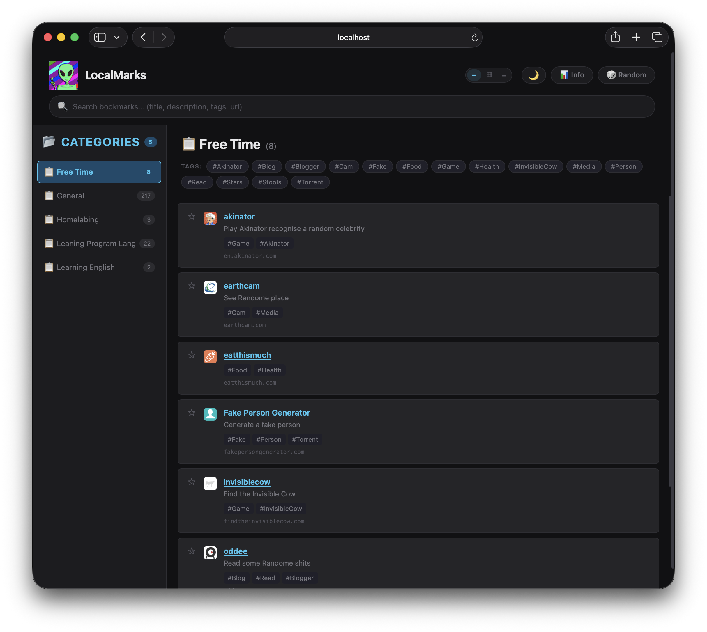
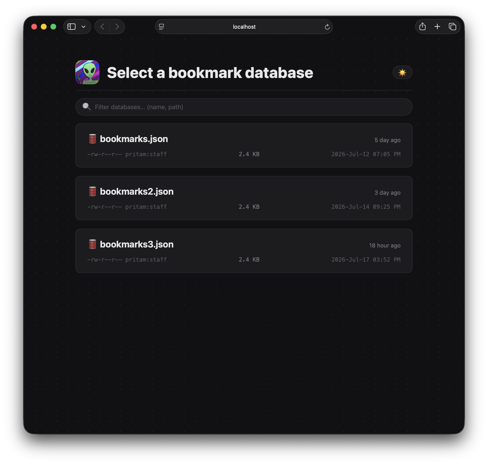
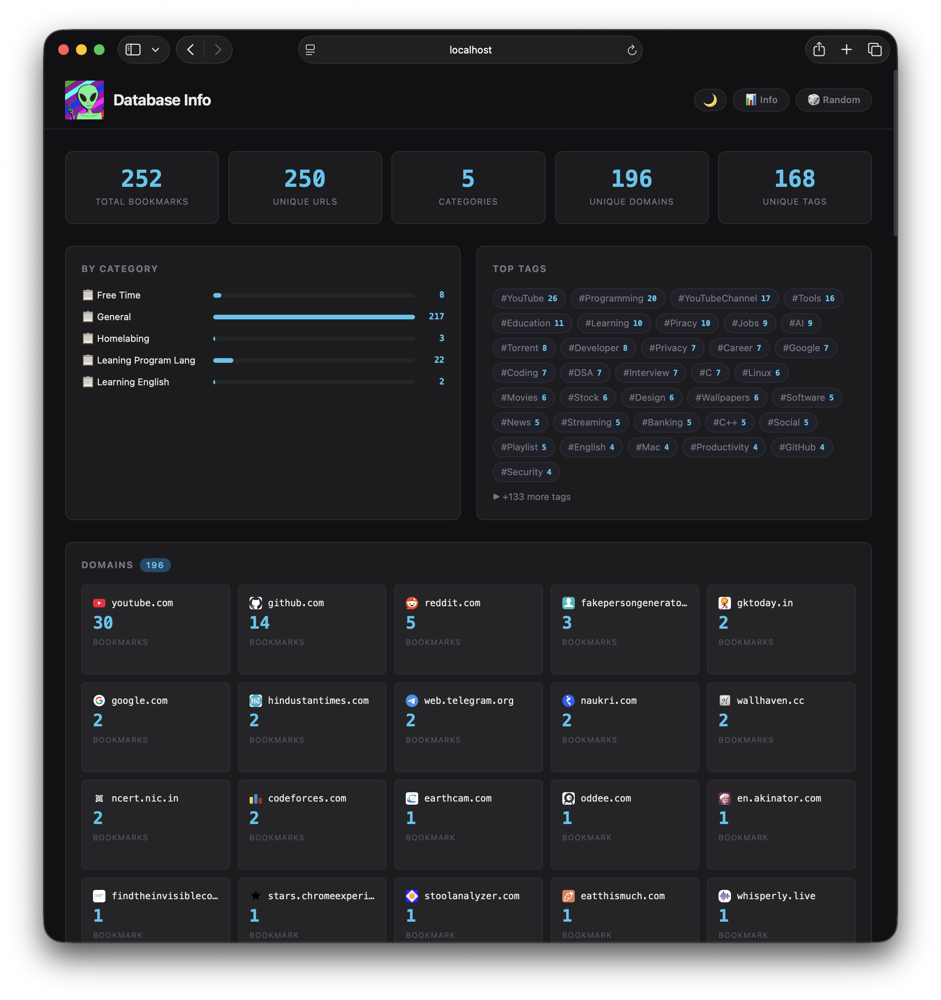
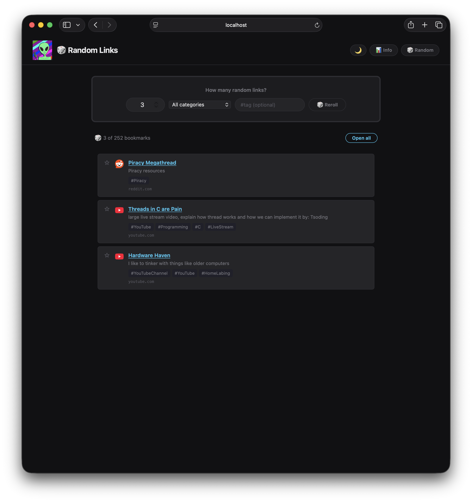

<h1 align="center">
	<br>
	
	<br>
	📚 LocalMarks
	<br>
	<br>
</h1>

Turn pipe-delimited bookmark files into a searchable, categorized local web UI. A single C17 binary serves a static frontend with tag/domain filters — no network required, just a browser.



## Table of Contents

- [Quick Start](#quick-start)
- [Prerequisites](#prerequisites)
- [Building from Source](#building-from-source)
- [Creating Your Bookmark Database](#creating-your-bookmark-database)
- [Running the Server](#running-the-server)
- [Multi-Database Support](#multi-database-support)
- [Configuration](#configuration)
- [TLS (HTTPS)](#tls-https)
- [Features](#features)
- [Keyboard Shortcuts](#keyboard-shortcuts)
- [Troubleshooting](#troubleshooting)
- [License](#license)

---

## Quick Start

```sh
# 1. Build
make

# 2. Create bookmark database from .txt files
./marks2json create *.txt -T bookmarks.json

# 3. Start the server
./local-mark bookmarks.json

# 4. Open http://localhost:8080
#    → Database Selector page → click a database to load it
```

---

## Prerequisites

| Platform   | Requirements                                              |
| ---------- | --------------------------------------------------------- |
| **macOS**  | Xcode Command Line Tools + `brew install argp-standalone` |
| **Linux**  | `clang` or `gcc` + `make` + `libc6-dev`                   |
| **Python** | 3.8+ (for `marks2json.py`, requires `requests` package)   |

> **Note**: The frontend is embedded in the binary via gzip-compressed C arrays. Opening `front_end/index.html` as `file://` will not work — browsers block `fetch()` on local files.

---

## Building from Source

```sh
make                      # Release build → ./local-mark (~400 KB)
make debug -B O_DEBUG=1   # Debug build (ASan + UBSan + stack usage)
make tls                  # Build with TLS support (downloads tlse library)
make clean                # Clean build artifacts
sudo make install         # Install to /usr/local/bin
```

See [DEV.md](DEV.md) for build flags, the embedding pipeline, and development workflow.

---

## Creating Your Bookmark Database

### Write `.txt` files (one per category)

```txt
# free_time.txt
# ── Games ───────────────────────────────────
akinator      | https://en.akinator.com          | Guess a celebrity     | #Game
invisiblecow  | https://findtheinvisiblecow.com/ | Find the Invisible Cow | #Game

# ── Reading ──────────────────────────────────
oddee         | https://www.oddee.com/           | Random interesting stuff | #Blog #Read
```

### Line format (pipe-delimited)

```
title | url | description | tags
```

| Field         | Required | Notes                                   |
| ------------- | -------- | --------------------------------------- |
| `title`       | no       | Display name; falls back to URL         |
| `url`         | **yes**  | Must contain `http://` or `https://`    |
| `description` | no       | Short note                              |
| `tags`        | no       | Space-separated, each prefixed with `#` |

**Rules**: Lines without `http(s)://` are skipped. Lines starting with `#` are comments. Empty lines are skipped. Filename becomes category name (`learning_python.txt` → "Learning Python").

### Convert to JSON

```sh
# Create new database
./marks2json create *.txt -T bookmarks.json

# Append new files (skips existing URLs)
./marks2json update new_stuff.txt -T bookmarks.json

# Force refresh existing entries
./marks2json update tools.txt refs.txt -T bookmarks.json --override

# Fetch YouTube channel icons (optional)
./marks2json create *.txt -T bookmarks.json --icon
```

### Check link health

```sh
./marks2json find-dead -T bookmarks.json

# Write clean database with only healthy links
./marks2json find-dead -T bookmarks.json --healthy healthy.json
```

---

## Running the Server

### Single Database

```sh
./local-mark bookmarks.json
# → http://localhost:8080 (Database Selector page)
```

### Multiple Databases

```sh
./local-mark work.json personal.json learning.json
# Switch between them via the Database Selector page
```

### Examples

```sh
# Public access with auth
./local-mark -u admin -p secret -H 0.0.0.0 bookmarks.json

# Custom port, more threads, open browser
./local-mark -P 3000 -T 4 -B bookmarks.json

# Rate limited, debug logs to file
./local-mark -M 10 -L debug -F server.log bookmarks.json
```

See [Configuration](#configuration) for all flags.

---

## Multi-Database Support

When you pass multiple `.json` files, the server shows a **Database Selector page** on startup. No database is loaded until you click one.

1. Server starts → Database Selector page (`#databases`)
2. Click a database card → selection saved to `localStorage`
3. Navigates to `#browse` → bookmarks fetched for that database
4. Switching databases fetches the new one in place (no full reload)

---

## Configuration

### CLI Flags

| Option         | Short | Default         | Description                                       |
| -------------- | ----- | --------------- | ------------------------------------------------- |
| `FILE...`      | —     | **required**    | Bookmark JSON file(s) (max 10)                    |
| `--port`       | `-P`  | `8080`          | TCP port                                          |
| `--host`       | `-H`  | `localhost`     | Bind address (`0.0.0.0` for all interfaces)       |
| `--user`       | `-u`  | —               | Basic auth username                               |
| `--pass`       | `-p`  | —               | Basic auth password                               |
| `--max-conns`  | `-M`  | `0` (unlimited) | Max concurrent connections per IP                 |
| `--browser`    | `-B`  | —               | Open browser on startup                           |
| `--log-level`  | `-L`  | `info`          | `error`, `warn`, `info`, `debug`                  |
| `--log-file`   | `-F`  | stderr          | Append logs to file                               |
| `--threads`    | `-T`  | `2`             | Worker thread pool size                           |
| `--keep-alive` | `-K`  | `3`             | Keep-alive timeout (seconds, 0 = disable)         |
| `--tls-cert`   | `-c`  | —               | Path to TLS certificate PEM (requires `make tls`) |
| `--tls-key`    | `-k`  | —               | Path to TLS private key PEM (requires `make tls`) |

No environment variables — all config via CLI flags for explicit, reproducible runs.

---

## TLS (HTTPS)

TLS requires building with `make tls` and providing both `--tls-cert` and `--tls-key`. Omitting either starts the server in plaintext mode.

```sh
make tls
./local-mark --tls-cert cert.pem --tls-key key.pem bookmarks.json
# → https://localhost:8080
```

### Creating a certificate

**Option A — mkcert (recommended, trusted by your browser):**

```sh
brew install mkcert    # or: apt install mkcert
mkcert -install        # installs local CA (one-time)
mkcert localhost       # → localhost.pem + localhost-key.pem
```

**Option B — OpenSSL (self-signed, shows browser warning):**

```sh
openssl req -x509 -newkey rsa:2048 -nodes \
  -keyout key.pem -out cert.pem -days 365 \
  -subj '/CN=localhost'
```

---

## Features

### Browse View (`#browse`)


- **Sidebar**: Categories with counts; Favorites appears at top when starred
- **Search**: Press `/` — searches title, description, tags, URL
- **Tag pills**: Click to filter; multi-select supported
- **Layout toggle**: Single / Grid / Compact — persisted
- **Sidebar resize**: Drag handle (160–480px), double-click to reset — persisted
- **Favicons**: Google favicon service + YouTube thumbnail fallback
- **Bookmark notes**: Press `n` on focused card to add/edit notes (stored in localStorage)

### Database Selector (`#databases`)



- File name, last modified (relative + absolute), permissions, owner:group
- "Current" badge on active database
- Search/filter by name or path

### Info View (`#info`)



- Stats strip: total bookmarks, unique URLs, categories, domains, tags
- Category bar chart, tag cloud, domain grid with favicons
- Link health check: async HEAD requests with progress bar

### Random View (`#random`)



- Pick N random links with category/tag filters
- "Open All" with staggered delays

### Theme System

- **Dark** (default) / **Light** (auto via `prefers-color-scheme` or manual toggle)
- Persisted to `localStorage`

### Persistence (localStorage)

| Key                    | Purpose                         |
| ---------------------- | ------------------------------- |
| `localmarks-favorites` | Starred bookmark URLs           |
| `localmarks-layout`    | `single` \| `grid` \| `compact` |
| `localmarks-sidebar-w` | Sidebar width (px)              |
| `localmarks-theme`     | `dark` \| `light`               |
| `localmarks-active-db` | Active database index           |

### IndexedDB Cache

- Database: `LocalMarksCache` / `bookmarks` store
- Per-database keys: `bookmarks:0`, `bookmarks:1`...
- Stale cache returns immediately; fresh fetch in background
- Force reload: `indexedDB.deleteDatabase('LocalMarksCache')` in DevTools

---

## Keyboard Shortcuts (Browse View)

| Key             | Action                       |
| --------------- | ---------------------------- |
| `j` / `↓`       | Next bookmark                |
| `k` / `↑`       | Previous bookmark            |
| `h` / `←`       | Back to categories (sidebar) |
| `l` / `→`       | Into bookmarks (cards)       |
| `gg`            | Jump to first                |
| `G` (`Shift+G`) | Jump to last                 |
| `/`             | Focus search                 |
| `Enter`         | Open in new tab              |
| `o`             | Open in same tab             |
| `yy`            | Copy URL (domain toast)      |
| `p`             | Toggle pin/favorite          |
| `n`             | Add/edit note                |
| `Esc`           | Clear search / close help    |
| `?`             | Toggle help modal            |
| `Ctrl/Cmd+K`    | Focus search                 |

---

## Troubleshooting

### `argp.h` not found (macOS)

```sh
brew install argp-standalone
```

### Port already in use

```sh
./local-mark -P 3000 bookmarks.json
# or
lsof -ti:8080 | xargs kill -9
```

### Stale data / database not loading

```sh
# Clear browser IndexedDB
indexedDB.deleteDatabase('LocalMarksCache')
```

### TLS browser warning (`NET::ERR_CERT_AUTHORITY_INVALID`)

Use `mkcert` instead of raw OpenSSL — see [TLS (HTTPS)](#tls-https).

---

## License

[MIT](LICENSE) — Copyright (c) 2026 Pritam

---

## See Also

- [DEV.md](DEV.md) — Architecture, API docs, build system, concurrency model
- [DEV_IN_DEPTH.md](DEV_IN_DEPTH.md) — Complete codebase reference for contributors and AI agents
- [marks2json.py](marks2json.py) — Converter source
- [local-mark.1](local-mark.1) — Man page
